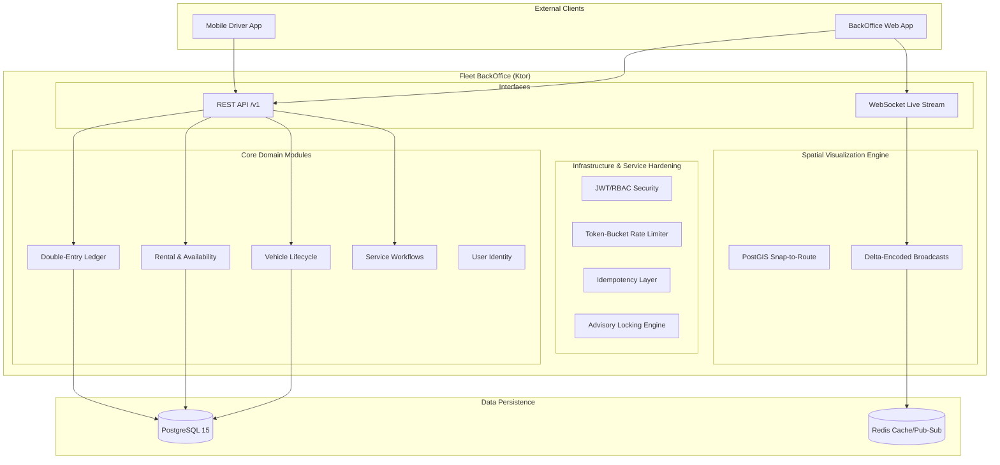

# Fleet Management System

A production-ready **Modular Monolith** built with **Kotlin** and **Ktor**, designed for high-scale vehicle rental operations, financial integrity, and real-time fleet visualization.

[](https://kotlinlang.org/)
[](https://ktor.io/)
[](https://www.postgresql.org/)
[](LICENSE)

---

## 🎯 Project Goals
- **Production-Grade Infrastructure**: Scalable, secure, and auditable backend for high-volume operations.
- **Financial Integrity**: Double-entry accounting with zero-sum validation and immutable transaction auditing.
- **Operational Safety**: Conflict prevention (double-booking) and strict Role-Based Access Control (RBAC).

---

## 🏗️ System Architecture

The system utilizes **Clean Architecture** to maintain a strict separation between core business rules (Domain), orchestration (Application), and external drivers (Infrastructure).



---

## 📊 Project Status (Phases 1-8)

| Category | Status | Key Features Delivered |
|-------|--------|-------------------|
| **Foundation** | ✅ **COMPLETE** | Ktor Framework, Request Tracking, Centralized Error Handling. |
| **Business Domains** | ✅ **COMPLETE** | Vehicles, Rentals, Maintenance, Customers, Accounting. |
| **Hardening** | ✅ **COMPLETE** | RBAC, Idempotency, Rate Limiting, Transactional Safety. |
| **Intelligence** | ✅ **COMPLETE** | PostGIS Route Snapping, Geofencing, WebSocket Broadcasts. |
| **Deployment** | ✅ **COMPLETE** | Dockerization, CI/CD Pipeline, Render Deployment. |

---

## 🚀 Quick API Reference

The system provides a comprehensive REST API documented via Swagger/OpenAPI.

- **Swagger UI**: [https://fleet-management-api-8tli.onrender.com/swagger](https://fleet-management-api-8tli.onrender.com/swagger) (Local)
- **Production Health**: [https://fleet-management-api-8tli.onrender.com/health](https://fleet-management-api-8tli.onrender.com/health)
- **OpenAPI Spec**: `src/main/resources/openapi.yaml`

### Endpoints Overview

| Module | Purpose | Key Endpoints | Access |
| :--- | :--- | :--- | :--- |
| **Auth** | Identity & Access | `/v1/users/login`, `/v1/users/register` | Public |
| **Vehicles** | Fleet Inventory | `/v1/vehicles`, `/v1/vehicles/{id}/state` | Auth |
| **Rentals** | Booking Lifecycle | `/v1/rentals`, `/v1/rentals/{id}/complete` | Auth |
| **Customers** | CRM & Registration | `/v1/customers`, `/v1/customers/register` | Mixed |
| **Accounting** | Ledger & Billing | `/v1/accounting/invoices`, `/v1/accounting/payments` | Auth (RBAC) |
| **Tracking** | Real-time GPS | `/v1/tracking/fleet/status`, `/v1/sensors/ping` | Auth |
| **Drivers** | Shift Management | `/v1/drivers`, `/v1/drivers/shifts/start` | Auth |

---

## 🛠️ Technology Stack

### Backend
- **[Kotlin](https://kotlinlang.org/)** & **[Ktor](https://ktor.io/)** (Async/Coroutines)
- **[Exposed ORM](https://github.com/JetBrains/Exposed)** (Type-safe SQL)
- **[PostgreSQL](https://www.postgresql.org/)** (Source of Truth) + **[PostGIS](https://postgis.net/)** (Spatial)
- **[Redis](https://redis.io/)** (Distributed Locking & Pub/Sub)

### Developer Tools
- **[Flyway](https://flywaydb.org/)** (Database Migrations)
- **[Testcontainers](https://www.testcontainers.org/)** (Integration Testing)
- **[JUnit 5](https://junit.org/junit5/)** & **[AssertJ](https://assertj.github.io/doc/)** (Testing)

---

## 🚀 Getting Started

### Prerequisites
- **JDK 17/21**
- **Docker Desktop** (Required for local DB & Redis)
- **Git**

### Local Setup
1. **Clone the repository**:
   ```bash
   git clone https://github.com/farsuller/fleet-management-system.git
   cd fleet-management-system
   ```
2. **Environment Configuration**:
   ```bash
   cp .env.example .env
   ```
3. **Start Infrastructure**:
   ```bash
   docker-compose up -d
   ```
4. **Run Application**:
   ```bash
   ./gradlew run
   ```

---

## 📁 Project Structure

```bash
fleet-management/
├── src/
│   ├── main/
│   │   ├── kotlin/com/solodev/fleet/
│   │   │   ├── Application.kt              # Entry point
│   │   │   ├── modules/                    # Domain-driven modules
│   │   │   │   ├── rentals/
│   │   │   │   ├── vehicles/
│   │   │   │   ├── accounts/
│   │   │   │   └── ...
│   │   │   └── shared/                     # Shared plugins & models
│   │   └── resources/
│   │       ├── application.conf            # App config
│   │       └── db/migration/               # Flyway SQL migrations
│   └── test/                               # Integration & Unit tests
├── docs/                                   # Advanced Documentation
│   ├── implementations/
│   └── tests-implementations/
└── build.gradle.kts                        # Build script
```

---

## 📖 Advanced Documentation

- **[Detailed Implementation Guide](./docs/implementations/BackOffice_v1_Implementations.md)** - Deep dive into core module logic.
- **[Integration Testing Standards](./docs/tests-implementations/PRACTICES_INTEGRATION_TEST.md)** - Best practices for testing.

---

## 📄 License
This project is licensed under the MIT License - see the [LICENSE](LICENSE) file for details.

---

**Happy Coding! 🚀**
