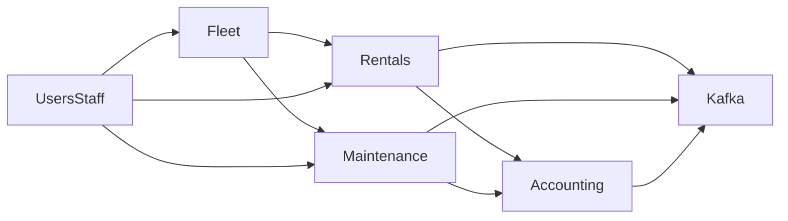

# Bounded Contexts & Invariants

This document defines **domain boundaries** and **non-negotiable invariants** for the Fleet Management System.

## Bounded contexts (ownership)

- **Fleet (Vehicles)**
  - Owns vehicle identity, attributes, and lifecycle state.
- **Rentals**
  - Owns reservations/rentals, pricing/charges, availability rules.
- **Maintenance**
  - Owns maintenance jobs, parts used, maintenance costs.
- **Users/Staff**
  - Owns staff profiles and authorization mapping (or integrates with external IdP).
- **Accounting**
  - Owns the ledger and posting rules (double-entry).
- **Reporting**
  - Owns derived read models and report generation (never changes facts).

## Integration rules

- Each context owns its business rules and data.
- Integrate via:
  - HTTP APIs for synchronous reads/commands
  - **Synchronous Transactional Postings** for Accounting (ensure atomic financial facts)
  - Kafka domain events for async integration (Planned for external systems)
- Avoid distributed transactions; prefer atomic updates + reconciliation.

## Core invariants

### Vehicle lifecycle

- Vehicle state machine:
  - `active -> rented -> active`
  - `active -> under_maintenance -> active`
  - `* -> decommissioned` (terminal)

### Rental correctness

- **No rental overlap** for the same vehicle while status is `reserved` or `active`.
- This must be enforced at the database layer in the Rentals context (exclusion constraint), not only in application logic.

### Maintenance correctness

- A vehicle cannot be rented while it is `under_maintenance` (enforced via state transitions + availability rules).

### Accounting correctness

- Accounting facts are **immutable**.
- Every posting is **idempotent** (retries do not create duplicate journal entries).
- Reports are derived from immutable facts and must be reproducible.

## Data flow sketch (high-level)

