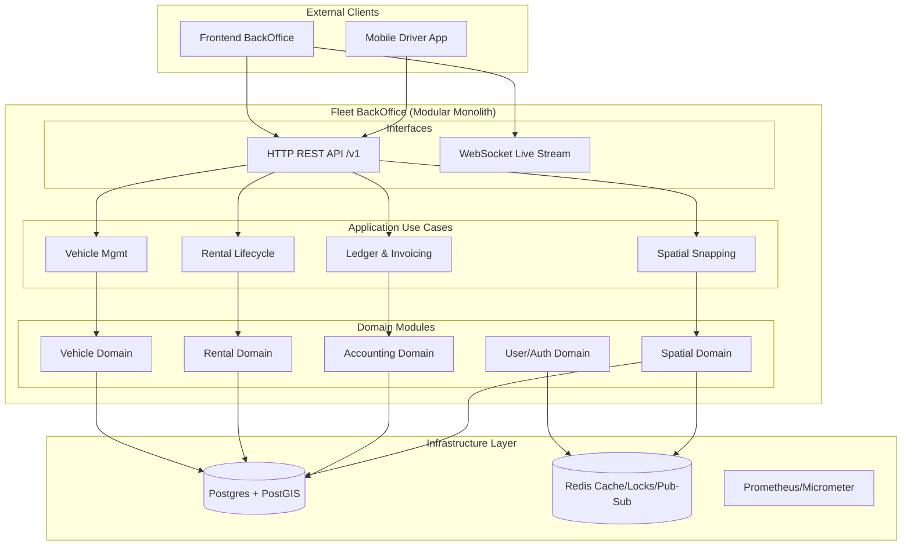
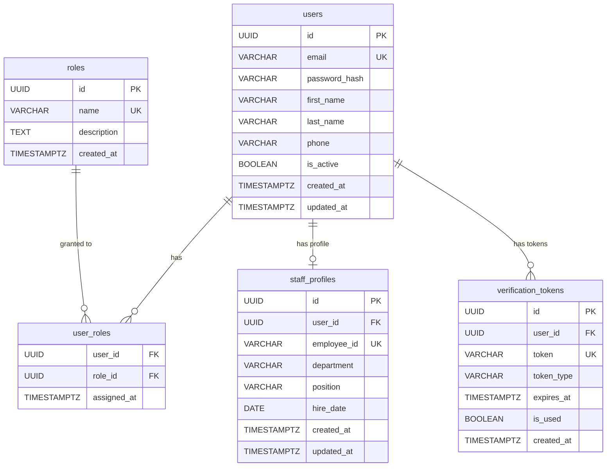
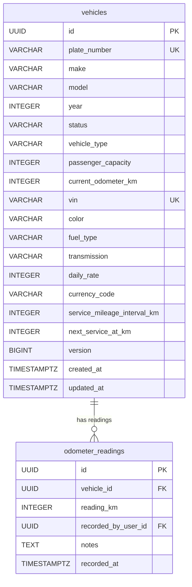
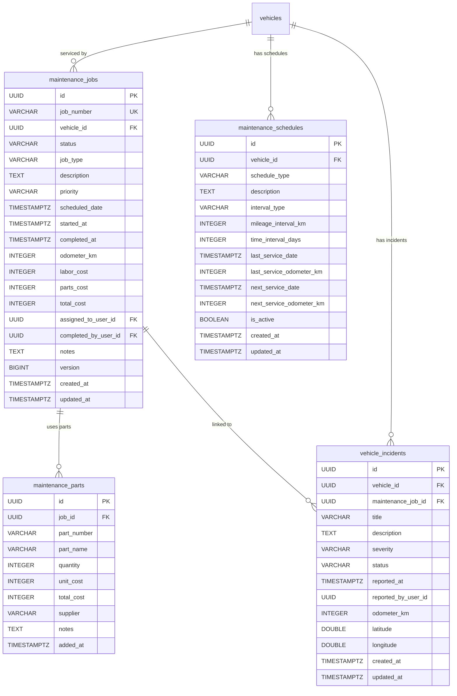
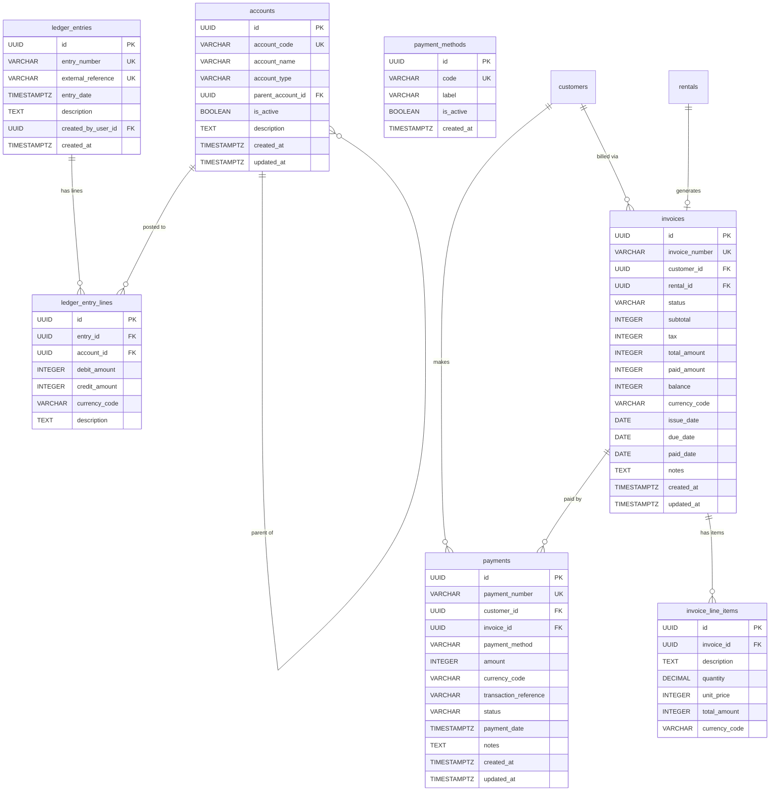
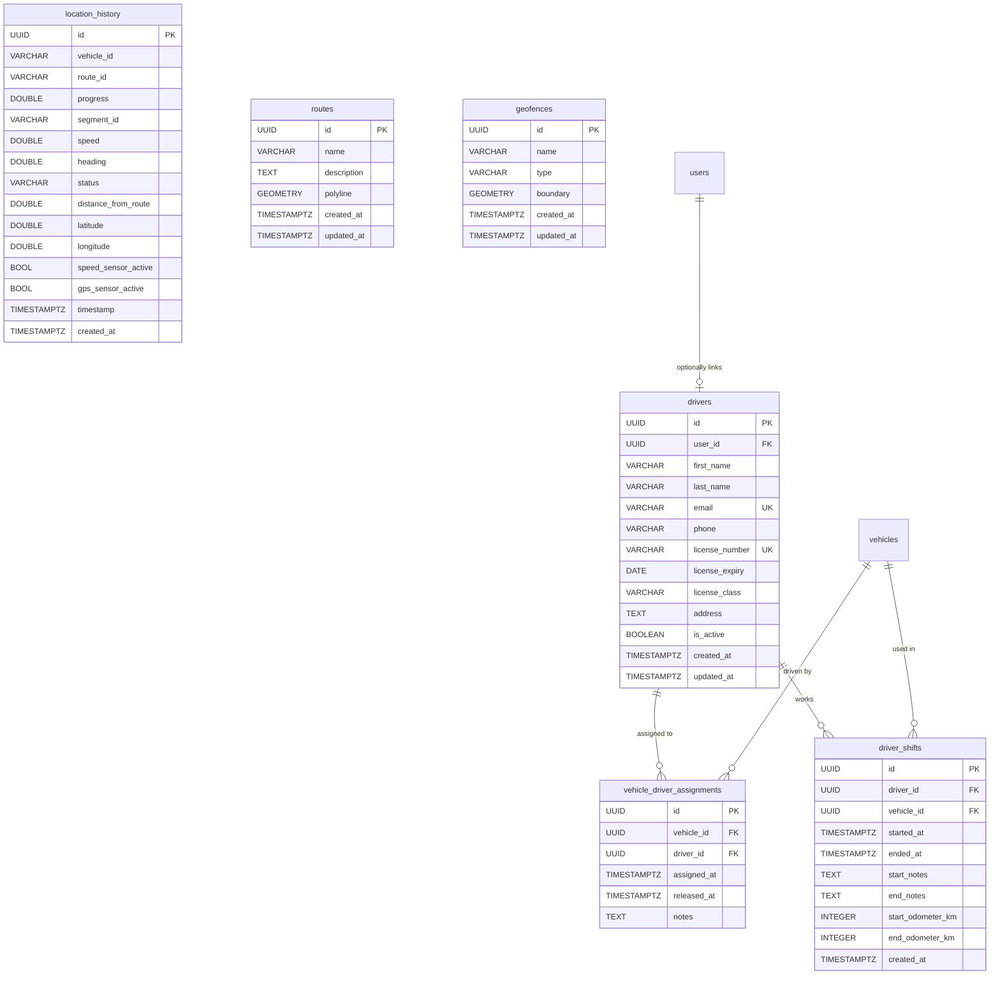
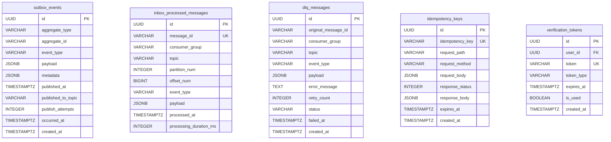
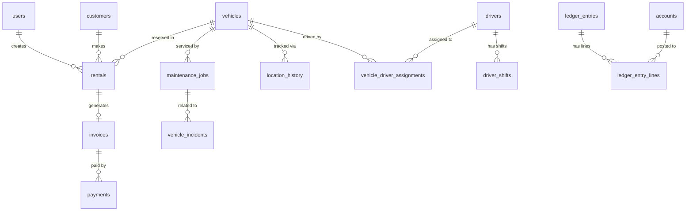

# Fleet Management BackOffice v1 — Comprehensive Implementation Guide

## 1. System Overview
The Fleet Management BackOffice is a robust, modular monolith built with **Kotlin** and **Ktor**, designed to manage high-scale vehicle rental operations. It utilizes **Clean Architecture** to ensure a strict separation between business logic (Domain), orchestration (Application), and external concerns (Infrastructure).

### Key Technical Pillars
- **Performance**: Asynchronous, non-blocking I/O via **Netty** and **Kotlin Coroutines**.
- **Reliability**: **PostgreSQL** (Active-Standby) for persistence with specialized extensions (**PostGIS**), **Redis** for distributed locking and caching.
- **Security**: **JWT-based stateless authentication** with **Role-Based Access Control (RBAC)**.
- **Scalability**: Designed for horizontal scaling on **Render** using **Redis Pub/Sub** for real-time synchronization across nodes.

---

## 2. System Architecture
The system follows a hexagonal pattern where the core domain logic is protected from external infrastructure changes.



---

## 3. Core Domain Modules

### 3.1 Vehicle Module
Responsible for the registration and lifecycle management of the fleet.
- **Core Entity**: `Vehicle` (VIN, License Plate, Make, Model, Year, State, Mileage).
- **Directory**: `src/main/kotlin/com/solodev/fleet/modules/vehicles/`
- **Invariants**:
    - Odometer readings must be monotonically increasing and recorded via `OdometerReading` events.
    - Vehicles in `MAINTENANCE` or `DECOMMISSIONED` states are strictly excluded from rental availability.
- **State Machine**: Transitions through `AVAILABLE`, `RENTED`, `MAINTENANCE`, `RESERVED`.
- **API Highlights**:
    - `POST /v1/vehicles` - Register new vehicle.
    - `PATCH /v1/vehicles/{id}/state` - Trigger manual state transition.
    - `POST /v1/vehicles/{id}/odometer` - Record mileage (captured at hand-off).

### 3.2 Rental Module
Manages the end-to-end reservation and rental lifecycle.
- **Core Entity**: `Rental` (Vehicle, Customer, Start/End Dates, Status, Financial Totals).
- **Directory**: `src/main/kotlin/com/solodev/fleet/modules/rentals/`
- **Concurrency & Integrity**:
    - Uses **PostgreSQL Advisory Locks** (`pg_advisory_xact_lock`) during reservation to serialize overlap checks.
    - **PostGIS TSTZRANGE Exclusion**: Prevents double-booking via DB-level GIST indexes on rental time ranges.
- **Lifecycle Transitions**:
    - `RESERVATION` → `ACTIVE` (Requires odometer capture).
    - `ACTIVE` → `COMPLETED` (Triggers invoice generation & ledger posting).
- **API Highlights**:
    - `POST /v1/rentals` - Reserve a vehicle (idempotent).
    - `POST /v1/rentals/{id}/activate` - Start the rental period.

### 3.3 Customer Module
Maintains driver profiles and insurance compliance.
- **Key Constraints**:
    - Mandatory unique indicators for Email and Driver License numbers.
    - **Identity Integrity**: Separate `CustomerRequest` and `CustomerResponse` DTOs ensure no leakage of internal DB metadata.
- **Health Monitoring**: Visual indicators in the UI provide real-time status of license expiration.
- **API Highlights**:
    - `POST /v1/customers` - Register a customer/driver.
    - `GET /v1/customers/{id}` - Retrieve detailed profile.

### 3.4 Maintenance Module
Ensures fleet safety through scheduled and reactive service.
- **Workflow**: `SCHEDULED` → `IN_PROGRESS` → `COMPLETED`.
- **Integration Invariant**: When a job moves to `IN_PROGRESS`, the associated vehicle status is automatically updated to `MAINTENANCE`, blocking it from the rental engine.
- **Cost Tracking**: Captures both labor and parts costs for total maintenance overhead analysis.
- **API Highlights**:
    - `POST /v1/maintenance/jobs` - Schedule a service job.
    - `POST /v1/maintenance/jobs/{id}/complete` - Record final costs and restore vehicle availability.

### 3.5 Accounting Module
A professional-grade double-entry ledger system.
- **Ledger Invariance**: Every transaction involves a Debit and a Credit across the **Chart of Accounts** (1000: Assets, 4000: Revenue, etc.) to ensure a zero-sum balance.
- **Real-time Postings**: Invoices are generated synchronously upon rental completion; payments are reconciled with idempotency protection.
- **API Highlights**:
    - `POST /v1/accounting/invoices` - Issue a bill against a rental/customer.
    - `POST /v1/accounting/payments` - Capture payment and post to Cash account.

---

## 4. Infrastructure Hardening & Plugins

### 4.1 Security (JWT & RBAC)
The system enforces **stateless** authentication and granular authorization.
- **Implementation**: `shared/plugins/Security.kt` and `shared/utils/JwtService.kt`.
- **RBAC Plugin**: Custom `withRoles` DSL.
- **Bypass Logic**: Users with the `ADMIN` role bypass specific role checks but are still audited.
- **Roles**: `ADMIN`, `FLEET_MANAGER`, `RENTAL_AGENT`, `DRIVER`, `CUSTOMER`.

### 4.2 API Abuse Protection (Rate Limiting)
Protects against DDoS and brute-force attacks using the **Token Bucket** strategy.
- **Implementation**: `shared/plugins/RateLimiting.kt`.
- **Tiers**:
    - `public_api` (100 req/min/IP)
    - `auth_strict` (5 req/min/IP for Login/Register)
    - `authenticated_api` (500 req/min/User ID)
- **Response**: Standardized 429 JSON response with `Retry-After` headers.

### 4.3 Idempotency & Concurrency
- **Idempotency**: All "dangerous" POST operations support the `Idempotency-Key` header. Responses are cached in Redis for 24 hours.
- **Optimistic Locking**: Critical entities use a `version` (xmin) column to detect concurrent edits.
- **Pessimistic Locking**: PostGIS/Rental overlap checks use explicit database locks to ensure serialized availability lookups.

---

## 5. Advanced Spatial & Real-time Features

### 5.1 PostGIS Spatial Engine
The system replaces raw coordinate storage with a high-performance spatial engine.
- **PostGIS Usage**: 
    - `ST_ClosestPoint`: Snaps raw GPS pings to the nearest pre-defined road segment.
    - `ST_LineLocatePoint`: Calculates a normalized progress value (0.0 to 1.0) along a route.
- **Integration**: `TrackingRoutes` receives sensor data, matches it via PostGIS, and updates the `vehicles` table state.

### 5.2 Visualization Engine (WebSockets)
Live fleet monitoring with high bandwidth efficiency.
- **Delta Encoding**: Only broadcasts updated properties (e.g., progress, heading, speed) in the WebSocket stream rather than full snapshots.
- **Redis Pub/Sub**: Real-time updates reaching one backend node are broadcast to all nodes via Redis, allowing every connected client across the cluster to see live movement.
- **Broadcast Scope**: 60 pings/min per vehicle, ensuring high-fidelity tracking without overwhelming the network.

---

## 6. Database Strategy
- **Source of Truth**: PostgreSQL 15 with PostGIS extension.
- **Migration**: Flyway handles versioned SQL migrations (`V001__...` to `V030__...`).
- **Primary Keys**: Strictly **UUID v4** to aid in data merging and prevent ID enumeration.
- **Audit Fields**: Every table includes `created_at`, `updated_at`, and `created_by` (where applicable).

### 6.1 Full Database Schema (ERD)

The schema is divided across 6 domain modules. All foreign keys are shown with relationship notation.

#### 👤 Identity & Access Module (V001)



#### 🚗 Fleet & Vehicle Module (V002, V026, V029)



#### 🏢 Rental & Customer Module (V003, V008)

```mermaid
erDiagram
    customers {
        UUID id PK
        UUID user_id FK
        VARCHAR first_name
        VARCHAR last_name
        VARCHAR email UK
        VARCHAR phone
        VARCHAR driver_license_number UK
        DATE driver_license_expiry
        TEXT address
        VARCHAR city
        VARCHAR state
        VARCHAR country
        BOOLEAN is_active
        TIMESTAMPTZ created_at
        TIMESTAMPTZ updated_at
    }
    rentals {
        UUID id PK
        VARCHAR rental_number UK
        UUID customer_id FK
        UUID vehicle_id FK
        UUID invoice_id FK
        VARCHAR status
        TIMESTAMPTZ start_date
        TIMESTAMPTZ end_date
        TIMESTAMPTZ actual_start_date
        TIMESTAMPTZ actual_end_date
        INTEGER daily_rate
        INTEGER total_amount
        VARCHAR currency_code
        INTEGER start_odometer_km
        INTEGER end_odometer_km
        VARCHAR pickup_location
        VARCHAR dropoff_location
        TEXT notes
        BIGINT version
        TIMESTAMPTZ created_at
        TIMESTAMPTZ updated_at
    }
    rental_periods {
        UUID rental_id PK_FK
        UUID vehicle_id FK
        TSTZRANGE period
        VARCHAR status
    }
    rental_charges {
        UUID id PK
        UUID rental_id FK
        VARCHAR charge_type
        TEXT description
        INTEGER amount
        VARCHAR currency_code
        UUID charged_by_user_id FK
        TIMESTAMPTZ charged_at
    }
    rental_payments {
        UUID id PK
        UUID rental_id FK
        VARCHAR payment_method
        INTEGER amount
        VARCHAR currency_code
        VARCHAR transaction_reference
        VARCHAR status
        TIMESTAMPTZ paid_at
        TIMESTAMPTZ created_at
        TIMESTAMPTZ updated_at
    }

    customers ||--o{ rentals : "makes"
    rentals ||--|| rental_periods : "has period"
    rentals ||--o{ rental_charges : "has charges"
    rentals ||--o{ rental_payments : "has payments"
```

#### 🔧 Maintenance Module (V004, V030)



#### 📒 Accounting Module (V005, V007, V010, V012, V013, V014)



#### 🚦 Driver, Spatial & Tracking Module (V017, V018, V019, V020, V022, V028)



#### 🔗 Integration & Reliability Module (V006, V009)



### 6.2 Cross-Module Relationship Overview



---

## 7. Deployment & DevOps
- **Hosting**: Render (Web Service + Managed Postgres + Redis).
- **Container**: Multi-stage `Dockerfile` (JDK 21 build → JRE 21 Alpine).
- **Environment**: Configured via `render.yaml` and environment variables.
- **CI/CD**: GitHub Actions pipeline covering unit/integration tests and auto-deploy to production upon successful master-branch merge.

---

## 8. Detailed API Reference Summary

The API is divided into **Back-Office Management** (Staff/Admin) and **Client-App Operations** (Driver/Mobile).

### 8.1 Identity & Security
| Method | Endpoint | Role Required | Description |
|:---|:---|:---|:---|
| `GET` | `/v1/auth/verify` | PUBLIC | Verify email token. |
| `POST` | `/v1/users/register` | PUBLIC | Register new administrative user. |
| `POST` | `/v1/users/login` | PUBLIC | Authenticate and retrieve JWT. |
| `GET` | `/v1/users` | ADMIN | List all system users. |
| `GET` | `/v1/users/roles` | STAFF | List available security roles. |
| `POST` | `/v1/users/{id}/roles` | ADMIN | Assign role to a specific user. |

### 8.2 Fleet Operations
| Method | Endpoint | Role Required | Description |
|:---|:---|:---|:---|
| `GET` | `/v1/vehicles` | STAFF | List fleet (with state filters). |
| `POST` | `/v1/vehicles` | ADMIN, MANAGER | Register new vehicle asset. |
| `PATCH` | `/v1/vehicles/{id}/state`| ADMIN, MANAGER | Force vehicle state transition. |
| `POST` | `/v1/vehicles/{id}/odometer`| STAFF | Record manual odometer reading. |

### 8.3 Rental Engine
| Method | Endpoint | Role Required | Description |
|:---|:---|:---|:---|
| `GET` | `/v1/rentals` | STAFF | List all reservations and active rentals. |
| `POST` | `/v1/rentals` | ADMIN, AGENT | Create a new reservation (Advisory Lock). |
| `POST` | `/v1/rentals/{id}/activate` | ADMIN, AGENT | Hand-off vehicle to customer. |
| `POST` | `/v1/rentals/{id}/complete` | ADMIN, AGENT | Return vehicle (Triggers accounting). |
| `POST` | `/v1/rentals/{id}/cancel` | ADMIN, AGENT | Cancel reservation before activation. |

### 8.4 Financial Accounting
| Method | Endpoint | Role Required | Description |
|:---|:---|:---|:---|
| `GET` | `/v1/accounting/invoices` | STAFF | List all billing documents. |
| `POST` | `/v1/accounting/payments` | ADMIN, AGENT | Record payment (Direct or Field). |
| `POST` | `/v1/accounting/remittances`| ADMIN, MANAGER | Verify driver field collections. |
| `GET` | `/v1/reports/revenue` | ADMIN | Category-wise revenue aggregation. |
| `GET` | `/v1/reports/balance-sheet`| ADMIN | Full ledger asset/liability snapshot. |
| `GET` | `/v1/reconciliation/integrity`| ADMIN | Verify double-entry ledger health. |

### 8.5 Spatial & Client-App Tracking
| Method | Endpoint | Role Required | Description |
|:---|:---|:---|:---|
| `POST` | `/v1/tracking/vehicles/{id}/location`| DRIVER | Snap-to-route GPS update (Idempotent). |
| `POST` | `/v1/sensors/ping` | DRIVER | IoT Batch sensor data ingestion. |
| `GET` | `/v1/tracking/fleet/status` | STAFF | Real-time map status of all vehicles. |
| `WS` | `/v1/fleet/live` | STAFF | WebSocket Delta-Encoded Live Stream. |
| `POST` | `/v1/tracking/admin/coordinate-reception`| ADMIN | Global tracking Kill-Switch. |

### 8.6 Driver & Shift Lifecycle
| Method | Endpoint | Role Required | Description |
|:---|:---|:---|:---|
| `POST` | `/v1/drivers/register` | PUBLIC | Driver self-registration (Mobile). |
| `POST` | `/v1/drivers/shifts/start` | DRIVER | Record start of duty and vehicle prep. |
| `POST` | `/v1/drivers/shifts/end` | DRIVER | Record end of duty and final notes. |
| `POST` | `/v1/drivers/{id}/assign` | MANAGER | Admin vehicle-to-driver assignment. |

---

> [!TIP]
> All endpoints return a standardized envelope:
> ```json
> {
>   "success": true,
>   "data": { ... },
>   "error": null,
>   "requestId": "req_8e23..."
> }
> ```

**Happy Coding! 🚀**
