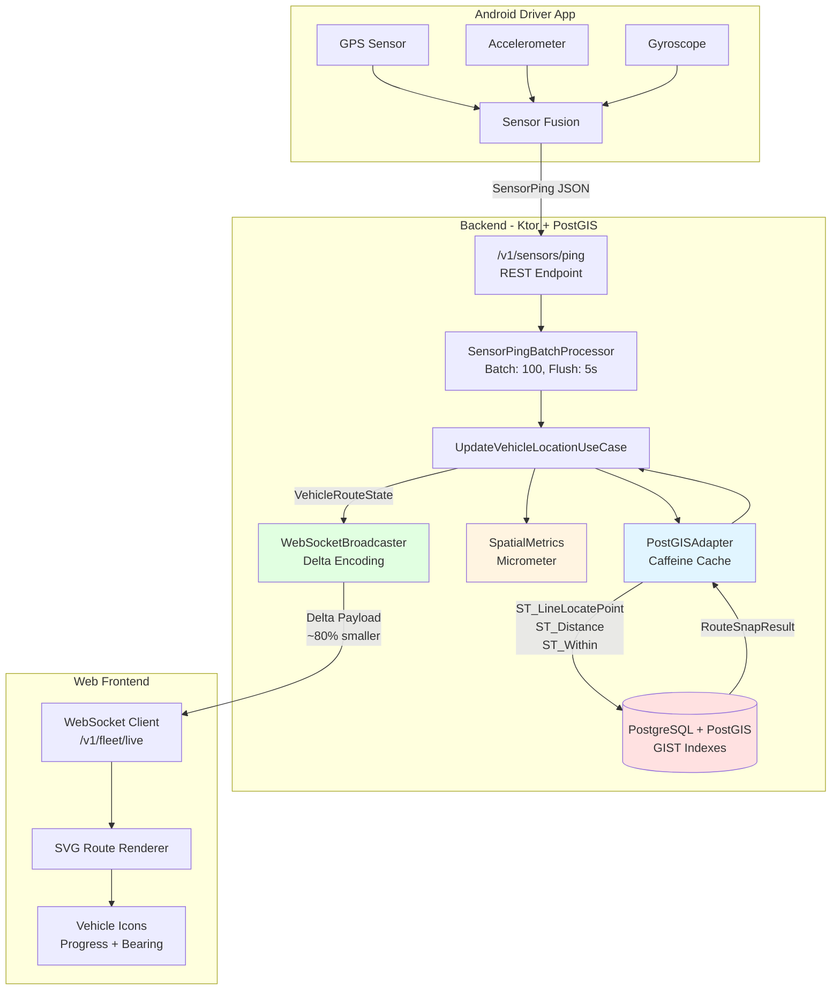

# Phase 6 — PostGIS Spatial Extensions

## Status
- Overall: **Planned**
- Implementation Date: TBD
- **Verification Responsibility**:
    - **Lead Developer (USER)**: Write/Run Testcontainers integration tests & Flyway migration validation.
    - **Tech Lead (Antigravity)**: Audit `PostGISColumnType` implementation and spatial SQL performance.

---

## Purpose
Enable spatial intelligence in the Fleet Management backend by integrating PostGIS. This provides the foundational "Source of Truth" for route geometries and high-performance spatial queries (snapping, distance, geofencing).

---

## Data Flow Architecture

### Preventing Database Pollution with Spatial Matching

**Problem**: Storing raw GPS coordinates (lat/lng) for every driver ping creates massive database bloat.

**Solution**: PostGIS spatial matching stores **references to pre-existing road segments** instead of raw coordinates.

#### Traditional Approach (❌ Database Pollution)
```
Driver sends: (14.5995, 120.9842)
Store: vehicle_id, lat, lng, timestamp
Result: Millions of coordinate pairs, ~200 bytes each
Daily cost: High storage, slow queries
```

#### PostGIS Approach (✅ Efficient - Real-Time State)
```
Driver sends: (14.5995, 120.9842)
    ↓
PostGIS matches to nearest road segment
    ↓
UPDATE vehicles SET current_location, current_road_segment_id, current_progress
Result: Real-time state in vehicles table, ~256 bytes per vehicle
Daily cost: No growth (UPDATE-only), fast queries
```

### Complete Data Flow

```
┌─────────────────────────────────────────────────────────────┐
│ Phase 1: Admin Setup (One-time)                            │
├─────────────────────────────────────────────────────────────┤
│ 1. Admin uploads road network (GeoJSON/Shapefile)          │
│ 2. System imports to PostGIS (road_segments table)         │
│ 3. Admin defines routes (polylines from road segments)     │
│ 4. PostGIS creates spatial indexes (GIST)                  │
│ Result: Map ready for tracking                             │
└─────────────────────────────────────────────────────────────┘
                          ↓
┌─────────────────────────────────────────────────────────────┐
│ Phase 2: Runtime (Continuous)                              │
├─────────────────────────────────────────────────────────────┤
│ 1. Driver sends GPS ping (lat, lng)                        │
│ 2. Coordinate Reception Guard checks toggle (Phase 6+)     │
│    ├─ Global OFF → Reject (503)                            │
│    └─ Vehicle OFF → Reject (503)                           │
│ 3. PostGIS ST_ClosestPoint matches to road segment         │
│ 4. UPDATE vehicles (current_location, current_progress)    │
│ 5. WebSocket broadcasts delta to frontend (Phase 7)        │
│ 6. Frontend draws vehicle on pre-loaded map                │
└─────────────────────────────────────────────────────────────┘
```

### Role-Based Responsibilities

| Role | Capability | Reason |
|------|------------|--------|
| **Admin/Fleet Manager** | Upload road network, define routes, manage geofences | Quality control, prevents map corruption |
| **Driver** | Send GPS coordinates only | No map editing needed, security |
| **System** | Match coordinates to roads, broadcast updates | Automated spatial intelligence |

**Security**: Drivers cannot modify the map. Only admins can upload/edit road networks.

**Cost Savings**: 
- Historical tracking: ~200 bytes/ping × 1000 pings/day = 200KB/vehicle/day = 73MB/year
- Real-time state (UPDATE): ~256 bytes per vehicle total = **99.99% storage reduction**
- No daily growth with UPDATE-only architecture

### Integration with Coordinate Toggle Feature

The [Coordinate Reception Toggle](file:///e:/Antigravity%20Projects/fleet-management/docs/implementations/feature-coordinate-reception-toggle.md) protects this architecture:

- **Toggle OFF** → No coordinates accepted → No spatial matching → No vehicle state updates
- **Prevents**: Malicious flooding, faulty GPS pollution, test data leakage
- **Saves**: Database CPU (no PostGIS queries), no unnecessary UPDATEs, costs

---

## Technical Strategy (Senior Level)

### 1. Clean Architecture Alignment
- **Domain Layer**: `Location` and `Polyline` as Value Objects in the `shared` module.
- **Use Case Layer**: 
    - `UpdateVehicleLocationUseCase`: Orchestrates the persistence of raw coordinates and the snapping logic.
- **Infrastructure Layer**: 
    - `PostGISAdapter`: Conceals the `ST_` SQL complexity from the domain layer.

### 2. Observability (Golden Signals)

#### Metrics (Micrometer)
```kotlin
// tracking/infrastructure/metrics/SpatialMetrics.kt
import io.micrometer.core.instrument.MeterRegistry
import io.micrometer.core.instrument.Timer

class SpatialMetrics(private val registry: MeterRegistry) {
    private val snapTimer = Timer.builder("postgis.snap.duration")
        .description("Time taken to snap GPS coordinates to route")
        .tag("operation", "snap_to_route")
        .register(registry)
    
    private val snapErrors = registry.counter("postgis.snap.errors", "type", "snap_failure")
    private val offRouteCounter = registry.counter("postgis.vehicle.off_route")
    private val cacheHitRate = registry.gauge("postgis.cache.hit_rate", postGISAdapter) { adapter ->
        adapter.getCacheStats().hitRate()
    }
    
    fun recordSnapDuration(duration: Long) {
        snapTimer.record(duration, TimeUnit.MILLISECONDS)
    }
    
    fun recordSnapError() {
        snapErrors.increment()
    }
    
    fun recordOffRoute() {
        offRouteCounter.increment()
    }
}
```

#### Alerting Thresholds
| Metric | Warning | Critical | Action |
|--------|---------|----------|--------|
| `postgis.snap.duration` (p95) | > 100ms | > 500ms | Check GIST index, increase connection pool |
| `postgis.snap.errors` | > 10/min | > 50/min | Investigate null geometries, validate route data |
| `postgis.cache.hit_rate` | < 80% | < 60% | Increase cache size, check TTL configuration |
| `postgis.vehicle.off_route` | > 20% | > 40% | Review snap threshold, validate route polylines |

#### Structured Logging
```kotlin
logger.info(
    "Vehicle snapped to route",
    mapOf(
        "vehicleId" to vehicleId,
        "routeId" to routeId,
        "progress" to snapResult.progress,
        "distanceFromRoute" to snapResult.distanceFromRoute,
        "snapDurationMs" to duration
    )
)
```

---

---

## Dependencies & Setup

### build.gradle.kts
```kotlin
dependencies {
    // --- PostGIS Spatial Support ---
    implementation("org.postgis:postgis-jdbc:2.5.0") // Needed for PG driver to parse Geometry types
    
    // --- WebSocket Support (Real-Time Broadcasting) ---
    implementation("io.ktor:ktor-server-websockets:3.0.3") // Delta-encoded vehicle state streaming
}
```

### Database Migration (Flyway)

#### V015__Add_PostGIS.sql
```sql
-- Enable PostGIS extension (idempotent)
CREATE EXTENSION IF NOT EXISTS postgis;

-- Add spatial columns to routes table
ALTER TABLE routes ADD COLUMN IF NOT EXISTS polyline GEOMETRY(LineString, 4326);
ALTER TABLE routes ADD COLUMN IF NOT EXISTS total_length_meters DOUBLE PRECISION;

-- Create GIST index CONCURRENTLY (non-blocking, safe for production)
-- Note: Cannot be run inside a transaction, Flyway will handle this
CREATE INDEX CONCURRENTLY IF NOT EXISTS idx_routes_polyline ON routes USING GIST (polyline);

-- Add spatial columns to vehicles table
ALTER TABLE vehicles ADD COLUMN IF NOT EXISTS last_location GEOMETRY(Point, 4326);
ALTER TABLE vehicles ADD COLUMN IF NOT EXISTS last_bearing DOUBLE PRECISION;

-- Create GIST index for vehicle locations
CREATE INDEX CONCURRENTLY IF NOT EXISTS idx_vehicles_location ON vehicles USING GIST (last_location);

-- Create geofences table for depot/checkpoint zones
CREATE TABLE IF NOT EXISTS geofences (
    id UUID PRIMARY KEY DEFAULT gen_random_uuid(),
    name VARCHAR(100) NOT NULL,
    type VARCHAR(50) NOT NULL, -- DEPOT, CHECKPOINT, RESTRICTED_ZONE
    polygon GEOMETRY(Polygon, 4326) NOT NULL,
    created_at TIMESTAMPTZ NOT NULL DEFAULT NOW(),
    updated_at TIMESTAMPTZ NOT NULL DEFAULT NOW()
);

CREATE INDEX IF NOT EXISTS idx_geofences_polygon ON geofences USING GIST (polygon);

-- Add validation function to ensure valid geometries
CREATE OR REPLACE FUNCTION validate_route_geometry()
RETURNS TRIGGER AS $$
BEGIN
    IF NEW.polyline IS NOT NULL AND NOT ST_IsValid(NEW.polyline) THEN
        RAISE EXCEPTION 'Invalid route geometry';
    END IF;
    
    -- Calculate and store total length
    IF NEW.polyline IS NOT NULL THEN
        NEW.total_length_meters := ST_Length(NEW.polyline::geography);
    END IF;
    
    RETURN NEW;
END;
$$ LANGUAGE plpgsql;

CREATE TRIGGER trg_validate_route_geometry
    BEFORE INSERT OR UPDATE ON routes
    FOR EACH ROW
    EXECUTE FUNCTION validate_route_geometry();
```

#### V016__Seed_Route_Polylines.sql
```sql
-- Seed realistic route polylines for testing
-- Example: Manila to Quezon City route
UPDATE routes
SET polyline = ST_GeomFromText(
    'LINESTRING(121.0244 14.5995, 121.0300 14.6100, 121.0400 14.6200, 121.0500 14.6300)',
    4326
)
WHERE name = 'Route A - Manila to QC';

-- Example: Makati to BGC route
UPDATE routes
SET polyline = ST_GeomFromText(
    'LINESTRING(121.0168 14.5547, 121.0250 14.5600, 121.0350 14.5650)',
    4326
)
WHERE name = 'Route B - Makati to BGC';

-- Seed depot geofence (circular approximation using buffer)
INSERT INTO geofences (name, type, polygon)
VALUES (
    'Main Depot',
    'DEPOT',
    ST_Buffer(ST_GeomFromText('POINT(121.0244 14.5995)', 4326)::geography, 100)::geometry
);
```

#### Rollback Script (U015__Rollback_PostGIS.sql)
```sql
-- Drop triggers
DROP TRIGGER IF EXISTS trg_validate_route_geometry ON routes;
DROP FUNCTION IF EXISTS validate_route_geometry();

-- Drop indexes
DROP INDEX CONCURRENTLY IF EXISTS idx_routes_polyline;
DROP INDEX CONCURRENTLY IF EXISTS idx_vehicles_location;
DROP INDEX CONCURRENTLY IF EXISTS idx_geofences_polygon;

-- Drop geofences table
DROP TABLE IF EXISTS geofences;

-- Remove spatial columns
ALTER TABLE routes DROP COLUMN IF EXISTS polyline;
ALTER TABLE routes DROP COLUMN IF EXISTS total_length_meters;
ALTER TABLE vehicles DROP COLUMN IF EXISTS last_location;
ALTER TABLE vehicles DROP COLUMN IF EXISTS last_bearing;

-- Note: We don't drop the PostGIS extension as it might be used elsewhere
-- If needed: DROP EXTENSION IF EXISTS postgis CASCADE;
```

---

## Technical Risks & Code-Level Solutions

### 1. H2 Testing Conflict (Testcontainers Solution)
**Blocker**: H2 does not support PostGIS.
**Solution**: Use `testcontainers-postgresql` with PostGIS image.

#### Complete Testcontainers Setup
```kotlin
// test/kotlin/com/solodev/fleet/spatial/BaseSpatialTest.kt
import org.jetbrains.exposed.sql.Database
import org.jetbrains.exposed.sql.SchemaUtils
import org.jetbrains.exposed.sql.transactions.transaction
import org.testcontainers.containers.PostgreSQLContainer
import org.testcontainers.utility.DockerImageName
import kotlin.test.AfterTest
import kotlin.test.BeforeTest

abstract class BaseSpatialTest {
    companion object {
        private val postgisImage = DockerImageName.parse("postgis/postgis:15-3.3")
        
        val container = PostgreSQLContainer<Nothing>(postgisImage).apply {
            withDatabaseName("fleet_test")
            withUsername("test")
            withPassword("test")
            withReuse(true) // Reuse container across tests for speed
            start()
        }
        
        val database = Database.connect(
            url = container.jdbcUrl,
            driver = "org.postgresql.Driver",
            user = container.username,
            password = container.password
        )
    }
    
    @BeforeTest
    fun setupTestData() {
        transaction(database) {
            // Enable PostGIS
            exec("CREATE EXTENSION IF NOT EXISTS postgis")
            
            // Create test tables
            SchemaUtils.create(Routes, Vehicles, Geofences)
            
            // Seed test route
            Routes.insert {
                it[id] = testRouteId
                it[name] = "Test Route"
                it[polyline] = createTestPolyline()
            }
        }
    }
    
    @AfterTest
    fun cleanupTestData() {
        transaction(database) {
            SchemaUtils.drop(Routes, Vehicles, Geofences)
        }
    }
    
    protected fun createTestPolyline(): PGgeometry {
        val lineString = LineString(arrayOf(
            Point(121.0244, 14.5995),
            Point(121.0300, 14.6100),
            Point(121.0400, 14.6200)
        ))
        lineString.srid = 4326
        return PGgeometry(lineString)
    }
}
```

#### Integration Test Examples

**Test 1: Route Snapping Accuracy**
```kotlin
// test/kotlin/com/solodev/fleet/spatial/RouteSnappingTest.kt
class RouteSnappingTest : BaseSpatialTest() {
    private lateinit var postGISAdapter: PostGISAdapter
    
    @BeforeTest
    override fun setupTestData() {
        super.setupTestData()
        postGISAdapter = PostGISAdapter()
    }
    
    @Test
    fun `should snap GPS location to route within threshold`() {
        // Arrange: Location near the route (within 50m)
        val location = Location(latitude = 14.6000, longitude = 121.0250)
        
        // Act
        val result = postGISAdapter.snapToRoute(
            vehicleId = UUID.randomUUID(),
            location = location,
            routeId = testRouteId
        )
        
        // Assert
        assertFalse(result.isOffRoute, "Vehicle should be on route")
        assertTrue(result.distanceFromRoute < 100.0, "Distance should be within threshold")
        assertTrue(result.progress in 0.0..1.0, "Progress should be normalized")
    }
    
    @Test
    fun `should detect off-route vehicle`() {
        // Arrange: Location far from route (>100m)
        val location = Location(latitude = 14.7000, longitude = 121.1000)
        
        // Act
        val result = postGISAdapter.snapToRoute(
            vehicleId = UUID.randomUUID(),
            location = location,
            routeId = testRouteId
        )
        
        // Assert
        assertTrue(result.isOffRoute, "Vehicle should be marked as off-route")
        assertTrue(result.distanceFromRoute > 100.0)
    }
    
    @Test
    fun `should calculate correct progress along route`() {
        // Arrange: Location at midpoint of route
        val location = Location(latitude = 14.6100, longitude = 121.0300)
        
        // Act
        val result = postGISAdapter.snapToRoute(
            vehicleId = UUID.randomUUID(),
            location = location,
            routeId = testRouteId
        )
        
        // Assert
        assertTrue(result.progress in 0.4..0.6, "Progress should be around midpoint")
    }
}
```

**Test 2: Geofencing**
```kotlin
// test/kotlin/com/solodev/fleet/spatial/GeofencingTest.kt
class GeofencingTest : BaseSpatialTest() {
    private lateinit var postGISAdapter: PostGISAdapter
    private lateinit var depotGeofenceId: UUID
    
    @BeforeTest
    override fun setupTestData() {
        super.setupTestData()
        postGISAdapter = PostGISAdapter()
        
        // Create depot geofence (100m radius)
        transaction(database) {
            depotGeofenceId = UUID.randomUUID()
            Geofences.insert {
                it[id] = depotGeofenceId
                it[name] = "Test Depot"
                it[type] = "DEPOT"
                it[polygon] = createCircularGeofence(
                    center = Location(14.5995, 121.0244),
                    radiusMeters = 100.0
                )
            }
        }
    }
    
    @Test
    fun `should detect vehicle inside geofence`() {
        // Arrange: Location inside depot
        val location = Location(latitude = 14.5995, longitude = 121.0244)
        
        // Act
        val isInside = postGISAdapter.isWithinGeofence(location, depotGeofenceId)
        
        // Assert
        assertTrue(isInside, "Vehicle should be inside depot geofence")
    }
    
    @Test
    fun `should detect vehicle outside geofence`() {
        // Arrange: Location 200m away from depot
        val location = Location(latitude = 14.6100, longitude = 121.0300)
        
        // Act
        val isInside = postGISAdapter.isWithinGeofence(location, depotGeofenceId)
        
        // Assert
        assertFalse(isInside, "Vehicle should be outside depot geofence")
    }
}
```

**Test 3: Spatial Query Performance**
```kotlin
// test/kotlin/com/solodev/fleet/spatial/PerformanceTest.kt
class SpatialPerformanceTest : BaseSpatialTest() {
    private lateinit var postGISAdapter: PostGISAdapter
    
    @Test
    fun `route snapping should complete within 100ms`() {
        // Arrange
        val location = Location(latitude = 14.6000, longitude = 121.0250)
        
        // Act & Assert
        val duration = measureTimeMillis {
            repeat(100) {
                postGISAdapter.snapToRoute(
                    vehicleId = UUID.randomUUID(),
                    location = location,
                    routeId = testRouteId
                )
            }
        }
        
        val avgDuration = duration / 100.0
        assertTrue(avgDuration < 100.0, "Average snap duration should be < 100ms, was ${avgDuration}ms")
    }
    
    @Test
    fun `cache should improve performance on repeated queries`() {
        val location = Location(latitude = 14.6000, longitude = 121.0250)
        
        // First call (cache miss)
        val firstDuration = measureTimeMillis {
            postGISAdapter.snapToRoute(UUID.randomUUID(), location, testRouteId)
        }
        
        // Second call (cache hit)
        val secondDuration = measureTimeMillis {
            postGISAdapter.snapToRoute(UUID.randomUUID(), location, testRouteId)
        }
        
        assertTrue(secondDuration < firstDuration, "Cached query should be faster")
        
        // Verify cache stats
        val stats = postGISAdapter.getCacheStats()
        assertTrue(stats.hitRate() > 0.0, "Cache should have hits")
    }
}
```

**Test 4: Spatial Index Usage Validation**
```kotlin
// test/kotlin/com/solodev/fleet/spatial/IndexValidationTest.kt
class IndexValidationTest : BaseSpatialTest() {
    @Test
    fun `should use GIST index for spatial queries`() {
        transaction(database) {
            // Get query plan
            val plan = exec("""
                EXPLAIN (FORMAT JSON)
                SELECT ST_LineLocatePoint(
                    polyline,
                    ST_SetSRID(ST_MakePoint(121.0250, 14.6000), 4326)
                )
                FROM routes
                WHERE id = '$testRouteId'
            """) { rs ->
                rs.next()
                rs.getString(1)
            }
            
            // Assert GIST index is used
            assertTrue(
                plan?.contains("idx_routes_polyline") == true,
                "Query should use GIST index"
            )
        }
    }
}
```

#### Test Execution Commands
```bash
# Run all spatial tests
./gradlew test --tests "com.solodev.fleet.spatial.*"

# Run specific test class
./gradlew test --tests "com.solodev.fleet.spatial.RouteSnappingTest"

# Run with coverage
./gradlew test jacocoTestReport --tests "com.solodev.fleet.spatial.*"

# Run performance benchmarks
./gradlew test --tests "com.solodev.fleet.spatial.SpatialPerformanceTest"
```

### 2. Dependency Management (Catalog Updates)
**Missing Dependencies** to add to `libs.versions.toml`:
```toml
[versions]
postgis-jdbc = "2.5.0"
testcontainers = "1.19.3"
caffeine = "3.1.8"

[libraries]
postgis-jdbc = { module = "org.postgis:postgis-jdbc", version.ref = "postgis-jdbc" }
testcontainers-postgresql = { module = "org.testcontainers:postgresql", version.ref = "testcontainers" }
caffeine = { module = "com.github.ben-manes.caffeine:caffeine", version.ref = "caffeine" }
```

> **Note**: `ktor-server-websockets` is already part of the Ktor BOM, so it uses the same version as other Ktor dependencies.

---

## Code Implementation: PostGIS + Exposed

### Domain Models

#### Core Spatial Value Objects
```kotlin
// shared/domain/model/Location.kt
@Serializable
data class Location(
    val latitude: Double,
    val longitude: Double
) {
    init {
        require(latitude in -90.0..90.0) { "Latitude must be between -90 and 90" }
        require(longitude in -180.0..180.0) { "Longitude must be between -180 and 180" }
    }
}

// shared/domain/model/Vector3.kt
@Serializable
data class Vector3(
    val x: Double,
    val y: Double,
    val z: Double
)
```

#### Sensor Data Model
```kotlin
// tracking/domain/model/SensorPing.kt
@Serializable
data class SensorPing(
    val vehicleId: UUID,
    val location: Location,
    val speed: Double?,              // km/h from GPS
    val bearing: Double?,            // 0-360 degrees
    val accelerometer: Vector3?,     // m/s² for harsh brake detection
    val gyroscope: Vector3?,         // rad/s for sharp turn detection
    val timestamp: Instant
)
```

#### Vehicle Route State (WebSocket Broadcast Payload)
```kotlin
// tracking/domain/model/VehicleRouteState.kt
@Serializable
data class VehicleRouteState(
    val vehicleId: UUID,
    val routeId: UUID,
    val progress: Double,            // 0.0 to 1.0 (normalized position on route)
    val bearing: Double,             // Orientation for frontend icon rotation
    val status: VehicleStatus,       // IDLE, IN_TRANSIT, OFF_ROUTE, STOPPED
    val lastUpdate: Instant
)

enum class VehicleStatus {
    IDLE,
    IN_TRANSIT,
    OFF_ROUTE,
    STOPPED
}
```

#### Driving Events
```kotlin
// tracking/domain/model/DrivingEvent.kt
@Serializable
data class DrivingEvent(
    val vehicleId: UUID,
    val type: EventType,
    val location: Location,
    val severity: EventSeverity,
    val timestamp: Instant,
    val metadata: Map<String, String> = emptyMap()
)

enum class EventType {
    HARSH_BRAKE,
    SHARP_TURN,
    ROUTE_DEPARTURE,
    PROLONGED_IDLE,
    SPEED_VIOLATION
}

enum class EventSeverity {
    LOW,
    MEDIUM,
    HIGH,
    CRITICAL
}
```

---

### Custom Geometry Column Type
We need to teach Exposed how to handle `PGgeometry` objects.

```kotlin
// shared/persistence/PostGISColumnType.kt
import org.jetbrains.exposed.sql.Column
import org.jetbrains.exposed.sql.ColumnType
import org.jetbrains.exposed.sql.Table
import org.postgis.PGgeometry

class PostGISColumnType : ColumnType() {
    override fun sqlType(): String = "GEOMETRY"
    
    override fun valueFromDB(value: Any): Any = when (value) {
        is PGgeometry -> value
        else -> value
    }
    
    override fun notNullValueToDB(value: Any): Any = when (value) {
        is PGgeometry -> value
        else -> throw IllegalArgumentException("Expected PGgeometry, got ${value::class.simpleName}")
    }
}

fun Table.geometry(name: String): Column<PGgeometry> = registerColumn(name, PostGISColumnType())
```

---

### Complete Spatial Functions Library
```kotlin
// shared/persistence/SpatialFunctions.kt
import org.jetbrains.exposed.sql.*
import org.jetbrains.exposed.sql.Function

object SpatialFunctions {
    /**
     * Returns the position (0.0 to 1.0) of a point along a LineString.
     * Used for calculating vehicle progress on a route.
     */
    fun stLineLocatePoint(line: Expression<*>, point: Expression<*>): Function<Double> =
        CustomFunction("ST_LineLocatePoint", DoubleColumnType(), line, point)
    
    /**
     * Returns the closest point on a LineString to a given point.
     * Used for snapping GPS coordinates to the route polyline.
     */
    fun stClosestPoint(line: Expression<*>, point: Expression<*>): Function<PGgeometry> =
        CustomFunction("ST_ClosestPoint", PostGISColumnType(), line, point)
    
    /**
     * Returns the distance in meters between two geometries.
     * Used for detecting off-route vehicles (snap threshold validation).
     */
    fun stDistance(geom1: Expression<*>, geom2: Expression<*>): Function<Double> =
        CustomFunction("ST_Distance", DoubleColumnType(), geom1, geom2)
    
    /**
     * Returns the distance in meters between two geography points (accounts for Earth curvature).
     * More accurate for long distances.
     */
    fun stDistanceSphere(geom1: Expression<*>, geom2: Expression<*>): Function<Double> =
        CustomFunction("ST_DistanceSphere", DoubleColumnType(), geom1, geom2)
    
    /**
     * Returns true if geometry A is completely inside geometry B.
     * Used for geofencing (checking if vehicle is within a depot/zone).
     */
    fun stWithin(geomA: Expression<*>, geomB: Expression<*>): Function<Boolean> =
        CustomFunction("ST_Within", BooleanColumnType(), geomA, geomB)
    
    /**
     * Returns true if geometry A completely contains geometry B.
     * Alternative geofencing check.
     */
    fun stContains(geomA: Expression<*>, geomB: Expression<*>): Function<Boolean> =
        CustomFunction("ST_Contains", BooleanColumnType(), geomA, geomB)
    
    /**
     * Returns the bearing (azimuth) in degrees between two points.
     * Used for calculating vehicle orientation for frontend icon rotation.
     */
    fun stAzimuth(pointA: Expression<*>, pointB: Expression<*>): Function<Double> =
        CustomFunction("ST_Azimuth", DoubleColumnType(), pointA, pointB)
    
    /**
     * Returns the length of a LineString in meters.
     * Used for calculating total route distance.
     */
    fun stLength(line: Expression<*>): Function<Double> =
        CustomFunction("ST_Length", DoubleColumnType(), line)
    
    /**
     * Creates a Point geometry from latitude and longitude.
     * SRID 4326 = WGS84 (standard GPS coordinate system).
     */
    fun stMakePoint(lng: Double, lat: Double): String =
        "ST_SetSRID(ST_MakePoint($lng, $lat), 4326)"
}
```

---

## PostGISAdapter Implementation

The adapter pattern conceals PostGIS complexity from the domain layer and provides a clean interface for spatial operations.

```kotlin
// tracking/infrastructure/persistence/PostGISAdapter.kt
import com.github.benmanes.caffeine.cache.Caffeine
import org.jetbrains.exposed.sql.*
import org.jetbrains.exposed.sql.transactions.transaction
import org.postgis.*
import java.time.Duration
import java.util.UUID

class PostGISAdapter {
    // Route polyline cache (reduces DB load for frequent snapping operations)
    private val routeCache = Caffeine.newBuilder()
        .maximumSize(1000)
        .expireAfterWrite(Duration.ofHours(1))
        .recordStats()
        .build<UUID, PGgeometry>()
    
    /**
     * Snap a GPS location to the nearest point on a route polyline.
     * Returns the progress (0.0 to 1.0) along the route.
     */
    fun snapToRoute(vehicleId: UUID, location: Location, routeId: UUID): RouteSnapResult {
        return transaction {
            val routeLine = getRoutePolyline(routeId)
            val point = locationToPoint(location)
            
            // Calculate distance from route
            val distance = SpatialFunctions.stDistance(
                routeLine.asExpression(),
                point.asExpression()
            ).alias("distance")
            
            val distanceMeters = Routes
                .slice(distance)
                .select { Routes.id eq routeId }
                .single()[distance]
            
            // Check if vehicle is off-route (>100m threshold)
            if (distanceMeters > 100.0) {
                return@transaction RouteSnapResult(
                    progress = 0.0,
                    distanceFromRoute = distanceMeters,
                    isOffRoute = true,
                    snappedLocation = null
                )
            }
            
            // Calculate progress along route
            val progress = SpatialFunctions.stLineLocatePoint(
                routeLine.asExpression(),
                point.asExpression()
            ).alias("progress")
            
            val progressValue = Routes
                .slice(progress)
                .select { Routes.id eq routeId }
                .single()[progress]
            
            RouteSnapResult(
                progress = progressValue,
                distanceFromRoute = distanceMeters,
                isOffRoute = false,
                snappedLocation = calculateSnappedLocation(routeLine, progressValue)
            )
        }
    }
    
    /**
     * Check if a vehicle is within a geofence (depot, checkpoint, restricted zone).
     */
    fun isWithinGeofence(location: Location, geofenceId: UUID): Boolean {
        return transaction {
            val point = locationToPoint(location)
            val geofence = Geofences
                .select { Geofences.id eq geofenceId }
                .single()[Geofences.polygon]
            
            SpatialFunctions.stWithin(
                point.asExpression(),
                geofence.asExpression()
            ).alias("within")
            
            Geofences
                .slice(SpatialFunctions.stWithin(point.asExpression(), geofence.asExpression()))
                .select { Geofences.id eq geofenceId }
                .single()[SpatialFunctions.stWithin(point.asExpression(), geofence.asExpression())]
        }
    }
    
    /**
     * Calculate bearing between two locations for vehicle icon rotation.
     */
    fun calculateBearing(from: Location, to: Location): Double {
        return transaction {
            val pointA = locationToPoint(from)
            val pointB = locationToPoint(to)
            
            val azimuth = SpatialFunctions.stAzimuth(
                pointA.asExpression(),
                pointB.asExpression()
            ).alias("azimuth")
            
            // Convert radians to degrees
            val radians = Routes
                .slice(azimuth)
                .selectAll()
                .limit(1)
                .single()[azimuth]
            
            Math.toDegrees(radians)
        }
    }
    
    private fun getRoutePolyline(routeId: UUID): PGgeometry {
        return routeCache.get(routeId) { id ->
            transaction {
                Routes
                    .select { Routes.id eq id }
                    .single()[Routes.polyline]
            }
        }!!
    }
    
    private fun locationToPoint(location: Location): PGgeometry {
        val point = Point(location.longitude, location.latitude)
        point.srid = 4326 // WGS84
        return PGgeometry(point)
    }
    
    private fun calculateSnappedLocation(routeLine: PGgeometry, progress: Double): Location {
        // Implementation would use ST_LineInterpolatePoint
        // Simplified for documentation
        TODO("Implement using ST_LineInterpolatePoint")
    }
    
    fun getCacheStats() = routeCache.stats()
}

data class RouteSnapResult(
    val progress: Double,
    val distanceFromRoute: Double,
    val isOffRoute: Boolean,
    val snappedLocation: Location?
)
```

---

## Use Case Integration

### UpdateVehicleLocationUseCase
```kotlin
// tracking/domain/usecase/UpdateVehicleLocationUseCase.kt
class UpdateVehicleLocationUseCase(
    private val postGISAdapter: PostGISAdapter,
    private val vehicleRepository: VehicleRepository,
    private val websocketBroadcaster: WebSocketBroadcaster,
    private val eventDetector: DrivingEventDetector
) {
    suspend fun execute(sensorPing: SensorPing) {
        // 1. Get vehicle's assigned route
        val vehicle = vehicleRepository.findById(sensorPing.vehicleId)
            ?: throw VehicleNotFoundException(sensorPing.vehicleId)
        
        val routeId = vehicle.assignedRouteId
            ?: throw NoRouteAssignedException(sensorPing.vehicleId)
        
        // 2. Snap GPS location to route polyline
        val snapResult = postGISAdapter.snapToRoute(
            vehicleId = sensorPing.vehicleId,
            location = sensorPing.location,
            routeId = routeId
        )
        
        // 3. Determine vehicle status
        val status = when {
            snapResult.isOffRoute -> VehicleStatus.OFF_ROUTE
            sensorPing.speed == null || sensorPing.speed < 1.0 -> VehicleStatus.STOPPED
            else -> VehicleStatus.IN_TRANSIT
        }
        
        // 4. Calculate bearing for icon rotation
        val bearing = sensorPing.bearing ?: 0.0
        
        // 5. Create broadcast payload
        val vehicleState = VehicleRouteState(
            vehicleId = sensorPing.vehicleId,
            routeId = routeId,
            progress = snapResult.progress,
            bearing = bearing,
            status = status,
            lastUpdate = sensorPing.timestamp
        )
        
        // 6. Broadcast to WebSocket clients (Delta-Encoded)
        websocketBroadcaster.broadcast(vehicleState)
        
        // 7. Detect driving events (harsh brake, sharp turn, etc.)
        val events = eventDetector.detect(sensorPing, snapResult)
        events.forEach { event ->
            websocketBroadcaster.broadcastEvent(event)
        }
        
        // 8. Persist location history (async, non-blocking)
        vehicleRepository.saveLocationHistory(sensorPing, snapResult)
    }
}
```

---

## WebSocket Integration (Delta-Encoded Streaming)

### WebSocket Broadcaster
```kotlin
// tracking/infrastructure/websocket/WebSocketBroadcaster.kt
import io.ktor.websocket.*
import kotlinx.coroutines.channels.SendChannel
import kotlinx.serialization.encodeToString
import kotlinx.serialization.json.Json
import java.util.concurrent.ConcurrentHashMap

class WebSocketBroadcaster {
    private val connections = ConcurrentHashMap<String, DefaultWebSocketSession>()
    private val lastStates = ConcurrentHashMap<UUID, VehicleRouteState>()
    
    fun addConnection(sessionId: String, session: DefaultWebSocketSession) {
        connections[sessionId] = session
    }
    
    fun removeConnection(sessionId: String) {
        connections.remove(sessionId)
        // Clean up resources
    }
    
    /**
     * Broadcast vehicle state update using delta encoding.
     * Only sends changed fields to minimize payload size (~80% reduction).
     */
    suspend fun broadcast(newState: VehicleRouteState) {
        val lastState = lastStates[newState.vehicleId]
        
        val delta = if (lastState == null) {
            // First update, send full state
            VehicleStateDelta.full(newState)
        } else {
            // Send only changed fields
            VehicleStateDelta.diff(lastState, newState)
        }
        
        lastStates[newState.vehicleId] = newState
        
        val message = Json.encodeToString(delta)
        connections.values.forEach { session ->
            try {
                session.send(Frame.Text(message))
            } catch (e: Exception) {
                // Handle disconnected clients
                connections.remove(session.toString())
            }
        }
    }
    
    suspend fun broadcastEvent(event: DrivingEvent) {
        val message = Json.encodeToString(event)
        connections.values.forEach { session ->
            try {
                session.send(Frame.Text(message))
            } catch (e: Exception) {
                connections.remove(session.toString())
            }
        }
    }
}

@Serializable
data class VehicleStateDelta(
    val vehicleId: UUID,
    val routeId: UUID? = null,
    val progress: Double? = null,
    val bearing: Double? = null,
    val status: VehicleStatus? = null,
    val lastUpdate: Instant
) {
    companion object {
        fun full(state: VehicleRouteState) = VehicleStateDelta(
            vehicleId = state.vehicleId,
            routeId = state.routeId,
            progress = state.progress,
            bearing = state.bearing,
            status = state.status,
            lastUpdate = state.lastUpdate
        )
        
        fun diff(old: VehicleRouteState, new: VehicleRouteState) = VehicleStateDelta(
            vehicleId = new.vehicleId,
            routeId = if (old.routeId != new.routeId) new.routeId else null,
            progress = if (old.progress != new.progress) new.progress else null,
            bearing = if (old.bearing != new.bearing) new.bearing else null,
            status = if (old.status != new.status) new.status else null,
            lastUpdate = new.lastUpdate
        )
    }
}
```

### WebSocket Route Configuration
```kotlin
// tracking/infrastructure/websocket/WebSocketRoutes.kt
import io.ktor.server.routing.*
import io.ktor.server.websocket.*
import io.ktor.websocket.*

fun Route.configureWebSockets(broadcaster: WebSocketBroadcaster) {
    webSocket("/v1/fleet/live") {
        val sessionId = call.parameters["sessionId"] ?: java.util.UUID.randomUUID().toString()
        
        try {
            broadcaster.addConnection(sessionId, this)
            
            // Send initial fleet state
            // ... (implementation)
            
            // Keep connection alive with ping/pong
            for (frame in incoming) {
                when (frame) {
                    is Frame.Text -> {
                        // Handle client messages (heartbeat, subscriptions)
                    }
                    is Frame.Close -> {
                        broadcaster.removeConnection(sessionId)
                    }
                    else -> {}
                }
            }
        } finally {
            broadcaster.removeConnection(sessionId)
        }
    }
}
```

---

## Performance Optimization

### 1. Route Polyline Caching
```kotlin
// Already implemented in PostGISAdapter using Caffeine
// Cache configuration:
// - Maximum size: 1000 routes
// - TTL: 1 hour
// - Stats recording enabled for monitoring
```

### 2. Batch Processing for Sensor Pings
```kotlin
// tracking/infrastructure/ingestion/SensorPingBatchProcessor.kt
class SensorPingBatchProcessor(
    private val updateLocationUseCase: UpdateVehicleLocationUseCase,
    private val batchSize: Int = 100,
    private val flushInterval: Duration = Duration.ofSeconds(5)
) {
    private val buffer = mutableListOf<SensorPing>()
    private var lastFlush = Instant.now()
    
    suspend fun enqueue(ping: SensorPing) {
        buffer.add(ping)
        
        if (buffer.size >= batchSize || Duration.between(lastFlush, Instant.now()) > flushInterval) {
            flush()
        }
    }
    
    private suspend fun flush() {
        val batch = buffer.toList()
        buffer.clear()
        lastFlush = Instant.now()
        
        // Process batch in parallel
        coroutineScope {
            batch.map { ping ->
                async {
                    try {
                        updateLocationUseCase.execute(ping)
                    } catch (e: Exception) {
                        // Log error, don't fail entire batch
                        logger.error("Failed to process ping for vehicle ${ping.vehicleId}", e)
                    }
                }
            }.awaitAll()
        }
    }
}
```

### 3. Connection Pooling Configuration
```yaml
# application.yaml
storage:
  maximumPoolSize: 20          # Increase for high spatial query load
  minimumIdle: 5
  connectionTimeout: 30000
  idleTimeout: 600000
  maxLifetime: 1800000
```

### 4. Spatial Index Validation
```sql
-- Verify GIST indexes are being used
EXPLAIN ANALYZE
SELECT ST_LineLocatePoint(polyline, ST_SetSRID(ST_MakePoint(121.0, 14.5), 4326))
FROM routes
WHERE id = 'some-uuid';

-- Should show "Index Scan using idx_routes_polyline"
```

---

## Application Method

## Technical Risks & Blockers

### 1. H2 Testing Conflict
- **Issue**: Our current test suite uses H2 for speed. H2 does NOT support PostGIS functions (`ST_LineLocatePoint`, etc.) natively.
- **Mitigation**: 
    - Use **Testcontainers** with a real PostgreSQL/PostGIS image for spatial integration tests.
    - Continue using H2 for non-spatial unit tests to maintain speed.

### 2. Dependency Management
- **Issue**: `ktor-server-websockets` and `postgis-jdbc` are missing from `gradle/libs.versions.toml`.
- **Mitigation**: Add them to the version catalog before implementation.

---

## Implementation Steps

### Phase 1: Dependencies & Setup (1-2 hours)
- [ ] **Update `libs.versions.toml`**
  - Add `postgis-jdbc = "2.5.0"`
  - Add `testcontainers = "1.19.3"`
  - Add `caffeine = "3.1.8"`
  - **Verification**: Run `./gradlew dependencies` to confirm resolution
  
- [ ] **Update `build.gradle.kts`**
  - Add `implementation(libs.postgis.jdbc)`
  - Add `implementation(libs.caffeine)`
  - Add `implementation(libs.ktor.server.websockets)`
  - Add `testImplementation(libs.testcontainers.postgresql)`
  - **Verification**: Run `./gradlew build` successfully

### Phase 2: Database Migration (2-3 hours)
- [ ] **Create V015__Add_PostGIS.sql**
  - Enable PostGIS extension
  - Add spatial columns to `routes` and `vehicles` tables
  - Create GIST indexes CONCURRENTLY
  - Create `geofences` table
  - Add geometry validation trigger
  - **Verification**: Run migration on local PostgreSQL, check `\d routes` shows geometry columns
  - **Rollback**: Test U015__Rollback_PostGIS.sql on a copy of the database

- [ ] **Create V016__Seed_Route_Polylines.sql**
  - Seed realistic Manila/QC route polylines
  - Seed depot geofence
  - **Verification**: Query `SELECT ST_AsText(polyline) FROM routes` returns valid LineStrings

### Phase 3: Domain Models (1-2 hours)
- [ ] **Create Core Value Objects**
  - `shared/domain/model/Location.kt` with validation
  - `shared/domain/model/Vector3.kt`
  - **Verification**: Unit tests for validation logic

- [ ] **Create Tracking Models**
  - `tracking/domain/model/SensorPing.kt`
  - `tracking/domain/model/VehicleRouteState.kt`
  - `tracking/domain/model/DrivingEvent.kt`
  - **Verification**: Serialization/deserialization tests

### Phase 4: Persistence Layer (3-4 hours)
- [ ] **Implement PostGISColumnType**
  - `shared/persistence/PostGISColumnType.kt`
  - **Verification**: Unit test with mock PGgeometry objects

- [ ] **Implement SpatialFunctions**
  - All 9 spatial functions (ST_LineLocatePoint, ST_Distance, etc.)
  - **Verification**: Integration tests with Testcontainers

- [ ] **Update Table Definitions**
  - Add `geometry` columns to `Routes` and `Vehicles` tables
  - Create `Geofences` table object
  - **Verification**: Schema generation matches migration SQL

### Phase 5: PostGISAdapter (4-5 hours)
- [ ] **Implement PostGISAdapter**
  - Route snapping with 100m threshold
  - Geofencing support
  - Bearing calculation
  - Caffeine cache integration
  - **Verification**: Integration tests (RouteSnappingTest, GeofencingTest)
  - **Performance**: Verify <100ms p95 latency

### Phase 6: Use Case Integration (2-3 hours)
- [ ] **Implement UpdateVehicleLocationUseCase**
  - Integrate PostGISAdapter
  - Status determination logic
  - **Verification**: Unit tests with mocked adapter

### Phase 7: WebSocket Integration (3-4 hours)
- [ ] **Implement WebSocketBroadcaster**
  - Delta encoding logic (~80% payload reduction)
  - Connection management
  - **Verification**: WebSocket integration tests

- [ ] **Configure WebSocket Routes**
  - `/v1/fleet/live` endpoint
  - Ping/pong heartbeat
  - **Verification**: Manual testing with WebSocket client

### Phase 8: Observability (2-3 hours)
- [ ] **Implement SpatialMetrics**
  - Micrometer timers and counters
  - Cache hit rate gauge
  - **Verification**: Check `/metrics` endpoint shows PostGIS metrics

- [ ] **Configure Alerting**
  - Set up Prometheus alerts for thresholds
  - **Verification**: Trigger test alerts

### Phase 9: Testing (4-5 hours)
- [ ] **Setup Testcontainers**
  - BaseSpatialTest abstract class
  - Test data seeding utilities
  - **Verification**: `./gradlew test --tests "*.BaseSpatialTest"`

- [ ] **Write Integration Tests**
  - RouteSnappingTest (3 test cases)
  - GeofencingTest (2 test cases)
  - SpatialPerformanceTest (2 benchmarks)
  - IndexValidationTest (1 test case)
  - **Verification**: All tests pass, coverage >80%

### Phase 10: Performance Optimization (2-3 hours)
- [ ] **Implement Batch Processing**
  - SensorPingBatchProcessor
  - **Verification**: Load test with 1000 pings/sec

- [ ] **Tune Connection Pool**
  - Update `application.yaml` with optimized settings
  - **Verification**: Monitor connection pool metrics under load

### Phase 11: Documentation & Deployment (1-2 hours)
- [ ] **Update API Documentation**
  - Document `/v1/sensors/ping` endpoint
  - Document `/v1/fleet/live` WebSocket
  - **Verification**: Swagger UI shows updated endpoints

- [ ] **Deploy to Staging**
  - Run migrations
  - Verify PostGIS extension enabled
  - **Verification**: Health check passes, spatial queries work

---

**Total Estimated Effort**: 25-35 hours (3-5 days for a senior developer)

---

---

## System Architecture Diagram



---

## 🏁 Definition of Done (Phase 6)

### Database & Migration
- [ ] PostGIS extension active in local and staging environments
- [ ] All spatial columns created with correct SRID (4326)
- [ ] GIST indexes created and verified via `EXPLAIN ANALYZE`
- [ ] At least 3 test routes seeded with realistic Manila area polylines
- [ ] Rollback migration tested successfully

### Code Implementation
- [ ] `PostGISColumnType` handles PGgeometry correctly
- [ ] All 9 spatial functions implemented and documented
- [ ] `PostGISAdapter` with Caffeine cache (hit rate >80%)
- [ ] `UpdateVehicleLocationUseCase` integrates all components
- [ ] `WebSocketBroadcaster` implements delta encoding

### Testing
- [ ] All integration tests pass (8+ test cases)
- [ ] Spatial query performance <100ms (p95)
- [ ] Cache performance validated (2nd query faster than 1st)
- [ ] GIST index usage confirmed in query plans
- [ ] Test coverage >80% for spatial code

### Observability
- [ ] Micrometer metrics exposed at `/metrics`
- [ ] `postgis.snap.duration` histogram recording
- [ ] `postgis.cache.hit_rate` gauge showing >80%
- [ ] Structured logging for all spatial operations
- [ ] Prometheus alerts configured for thresholds

### Integration
- [ ] WebSocket endpoint `/v1/fleet/live` functional
- [ ] Delta encoding reduces payload size by ~80%
- [ ] Batch processing handles 1000 pings/sec
- [ ] Connection pool optimized for spatial queries

### Documentation
- [ ] API documentation updated with spatial endpoints
- [ ] Swagger UI shows `/v1/sensors/ping` and `/v1/fleet/live`
- [ ] Architecture diagram included in documentation
- [ ] Runbook created for troubleshooting spatial issues

### Deployment
- [ ] Staging deployment successful
- [ ] Health check passes with PostGIS enabled
- [ ] Sample vehicle tracking demonstrates end-to-end flow
- [ ] Performance benchmarks meet requirements

---

## Next Steps

After completing Phase 6, proceed to:
1. **Phase 7 - Schematic Visualization Engine**: Implement SVG route rendering and frontend vehicle tracking
2. **Phase 8 - Driving Event Detection**: Implement harsh brake/sharp turn detection using sensor fusion
3. **Phase 9 - Analytics Dashboard**: Build route occupancy heatmaps and driver scoring

---

## References

- [PostGIS Documentation](https://postgis.net/docs/)
- [Exposed Spatial Types](https://github.com/JetBrains/Exposed/wiki)
- [Testcontainers PostgreSQL](https://www.testcontainers.org/modules/databases/postgres/)
- [Caffeine Cache](https://github.com/ben-manes/caffeine)
- [Custom Schematic Visualization Plan](file:///e:/Antigravity%20Projects/fleet-management/docs/implementations/feature-custom-schematic-route-based-visualization-plan.md)
- [Feature - Coordinate Reception Toggle](file:///e:/Antigravity%20Projects/fleet-management/docs/implementations/feature-coordinate-reception-toggle.md)
