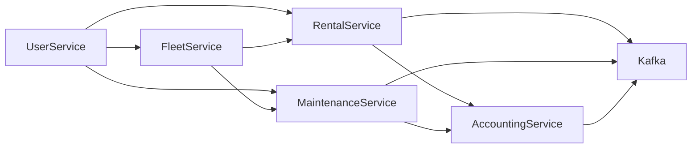

# Fleet Management Backend: Phases + Schemas

This plan is designed to be appended to `[skills/backend-development/SKILL.md](skills/backend-development/SKILL.md)` as a “project blueprint” section.

## Goals

- Deliver a production-grade Fleet Management backend covering vehicles, rentals, maintenance, staff/users, and accounting/reports.
- Maintain financial correctness (auditable, reproducible), prevent double-booking, and support independent deployability.

## Assumptions (match current skill doc)

- Kotlin backend using **Ktor** (coroutine-first) and clean/hexagonal architecture principles.
- AuthN/AuthZ: **OAuth 2.0 + JWT**, with **RBAC via JWT claims** and domain-level authorization rules.
- PostgreSQL is the **source of truth**; Redis is **cache/locks/ephemeral only** (explicit TTLs; never a source of truth).
- Kafka for domain events with **at-least-once delivery**; consumers must be **idempotent**, with explicit retries and DLQ handling.
- Prefer domain-owned data stores (no shared DB); integrate via well-defined APIs and domain events.
- Configuration via **YAML/HOCON with env-based overrides**; secrets injected via environment variables / Kubernetes Secrets.
- Scheduling/background work: coroutine-based schedulers for lightweight jobs; **Quartz** for durable/complex scheduling; prefer external workers for heavy/long-running jobs.
- Observability: structured **JSON logging**, custom **health endpoints**, metrics via **Micrometer**, tracing via **OpenTelemetry**.

## Delivery Phases (recommended)

### Phase 0 — Plan (requirements, dependencies, boundaries)

 - Details and implementation tracker: `phase-0-plan.md`

#### Requirements (functional)

- Vehicle lifecycle management (register/update, state transitions, odometer)
- Rental management (quote, reserve, activate, complete/cancel, availability)
- Maintenance management (schedule, start/complete, parts used, costs)
- Users & staff management (OAuth2/JWT, RBAC, staff profiles)
- Accounting & reports (invoices/charges/payments, immutable ledger postings, reproducible reports)

#### Requirements (non-functional)

- Financial and data correctness (auditable, reproducible, idempotent processing)
- Concurrency safety (prevent double-booking; safe state transitions)
- Reliability (graceful retries, DLQs, backpressure; safe replays)
- Security (least privilege, consistent authorization checks)
- Observability (structured logging, metrics, tracing, health endpoints)
- Deployability (local dev parity; EKS-ready manifests and configuration)

#### Dependencies

- Runtime/framework: Kotlin (JVM), Ktor, Kotlin Coroutines
- Auth: OAuth 2.0 + JWT (RBAC via JWT claims)
- Data: PostgreSQL (source of truth), migrations (Flyway/Liquibase), Exposed/jOOQ/Hibernate (per module)
- Messaging: Kafka (at-least-once, explicit offsets, retries, DLQ)
- Cache/locks: Redis (ephemeral only, explicit TTLs)
- Scheduling: coroutine-based schedulers (lightweight), Quartz (durable/complex), external workers (heavy jobs)
- Observability: structured JSON logs, Micrometer, OpenTelemetry, health endpoints
- Local dev: Docker Compose and/or Testcontainers for PostgreSQL/Kafka/Redis
- Deployment: Kubernetes/EKS (Deployment/Service/ConfigMap/Secret/HPA, probes)

#### Domain boundaries & invariants (must be agreed in Phase 0)

- Vehicle state machine: `active -> rented -> active`, `active -> under_maintenance -> active`, `* -> decommissioned`.
- Rental correctness: **no overlap** for the same vehicle while `reserved|active` (enforced at DB level in Rental service).
- Accounting correctness: reports derived from **immutable transactions** (double-entry postings).
- Data ownership: domains own their data; integrations via APIs/events (avoid shared DBs).

#### Outputs (deliverables)

- Domain glossary + bounded-context map (vehicles/rentals/maintenance/users/accounting/reporting)
- API standards (error envelope, correlation IDs, idempotency keys, auth claim conventions)
- Event catalog (event names, schemas, keys/partitioning, versioning, retry/DLQ policy, replay plan)
- Persistence blueprint per domain (tables, constraints, indexing, transaction boundaries, migration strategy)
- Observability baseline (log fields, metric naming, trace propagation, health checks)
- Deployment baseline (local dev compose/testcontainers plan; EKS manifest checklist)

#### Code impact

- **No code required in Phase 0**: this phase is planning + documentation only.
- If you want Phase 0 to produce repo artifacts, keep them documentation-only (e.g., `docs/architecture/`, `docs/decisions/`, diagrams).

### Phase 1 — Architecture skeleton

- ✅ Details and implementation tracker: `phase-1-architecture-skeleton.md`

- ✅ Create service/module templates:
  - ✅ Ktor HTTP API with explicit routing and request pipeline.
  - ✅ Domain layer + persistence adapters (choose Exposed/jOOQ/Hibernate per module; keep transaction boundaries explicit).
  - ✅ API-boundary validation + fail-fast behavior for invalid state transitions.
  - ✅ Observability: structured JSON logs, metrics (Micrometer), tracing (OpenTelemetry), and health endpoints.
  - ✅ Migrations via Flyway/Liquibase (per service/module).
- ✅ Define cross-cutting standards:
  - ✅ Correlation IDs, request idempotency keys, stable error envelope.
  - ✅ Auth standards: JWT claim conventions, RBAC mapping, and consistent authorization checks.
  - ✅ Messaging standards: outbox pattern for publishing Kafka events; inbox/idempotency for consumers; retry + DLQ policies.
  - ✅ Local dev profile: Docker Compose/Testcontainers for PostgreSQL/Kafka/Redis and env-based configuration parity.

### Phase 2 — PostgreSQL schema v1 (source of truth) ✅

- ✅ Details and implementation tracker: `phase-2-postgresql-schema-v1.md`

- ✅ Implement schemas below per domain service.
- ✅ Add constraints/indexes that enforce correctness at the DB level.

### Phase 3 — API surface v1 ⏳

- ⏳ Details and implementation tracker: `phase-3-api-surface-v1.md`

- ⏳ Implement minimal endpoints per domain:
  - ✅ Vehicles: register/update/state transitions, odometer updates.
  - ✅ Rentals: quote, reserve, activate, complete/cancel, availability checks.
  - ✅ Maintenance: schedule/start/complete, parts used, costs.
  - ✅ Users/Staff: RBAC and staff profiles.
  - ✅ Accounting: invoices/charges/payments + ledger postings.

### Phase 4 — Eventing (Kafka) + integration 📅

- 📅 Details and implementation tracker: `phase-4-eventing-kafka-integration.md`

- Publish domain events via outbox:
  - `VehicleRegistered`, `VehicleStateChanged`
  - `RentalReserved`, `RentalActivated`, `RentalCompleted`, `RentalCancelled`
  - `MaintenanceScheduled`, `MaintenanceCompleted`
  - `InvoiceIssued`, `PaymentCaptured`, `LedgerPosted`
- Consumers:
  - Enforce idempotency via `inbox_processed_messages`.
  - Manage offsets explicitly; design for at-least-once delivery and safe retries.
  - Use DLQs for poison messages; document replay procedures.

### Phase 5 — Reporting and accounting correctness

- Details and implementation tracker: `phase-5-reporting-and-accounting-correctness.md`

- Accounting uses double-entry postings as immutable facts.
- Reports generated from ledger + immutable rental/maintenance facts.
- Optionally add report snapshots for performance (never overwrite facts).

### Phase 6 — Hardening

- Details and implementation tracker: `phase-6-hardening.md`

- Concurrency: transactional boundaries, advisory locks where needed.
- Security: RBAC checks at boundaries, least privilege.
- Load: index tuning, query plans, backpressure on consumers.

### Phase 7 — Deployment

- Details and implementation tracker: `phase-7-deployment.md`

- Docker Compose/Testcontainers for local.
- Kubernetes/EKS manifests (Deployment/Service/ConfigMap/Secret/HPA) with:
  - Readiness/liveness probes (wired to health endpoints)
  - Environment-driven configuration (no hardcoded secrets)
  - Reasonable resource requests/limits and autoscaling guidance

## Schemas (PostgreSQL blueprint)

### Conventions (apply to all services)

- Primary keys: `id UUID PRIMARY KEY`.
- Timestamps: `created_at TIMESTAMPTZ NOT NULL`, `updated_at TIMESTAMPTZ NOT NULL`.
- Soft delete where needed: `deleted_at TIMESTAMPTZ NULL`.
- Audit: `created_by UUID NULL`, `updated_by UUID NULL` (actor user id).
- Optimistic concurrency: `row_version BIGINT NOT NULL DEFAULT 0` (or use `xmin`).
- Money: `amount_cents BIGINT`, `currency CHAR(3)` (avoid float).
- Status fields: `TEXT` with CHECK constraints or PostgreSQL ENUM (prefer CHECK for easier evolution).

### Shared integration tables (per service)

#### `outbox_events`

- `id UUID PK`
- `aggregate_type TEXT NOT NULL`
- `aggregate_id UUID NOT NULL`
- `event_type TEXT NOT NULL`
- `payload JSONB NOT NULL`
- `occurred_at TIMESTAMPTZ NOT NULL`
- `published_at TIMESTAMPTZ NULL`
- Index: `(published_at) WHERE published_at IS NULL`

#### `inbox_processed_messages`

- `message_id TEXT PK` (Kafka key+partition+offset or producer GUID)
- `processed_at TIMESTAMPTZ NOT NULL`

### Identity & Access Service (users/staff)

#### `users`

- `id UUID PK`
- `email CITEXT UNIQUE NOT NULL`
- `password_hash TEXT NOT NULL` (if not delegating to external IdP)
- `status TEXT NOT NULL CHECK (status IN ('active','disabled'))`

#### `roles`

- `id UUID PK`
- `name TEXT UNIQUE NOT NULL`

#### `permissions`

- `id UUID PK`
- `name TEXT UNIQUE NOT NULL` (e.g. `rentals.reserve`, `vehicles.decommission`)

#### `user_roles`

- `user_id UUID NOT NULL REFERENCES users(id)`
- `role_id UUID NOT NULL REFERENCES roles(id)`
- PK: `(user_id, role_id)`

#### `role_permissions`

- `role_id UUID NOT NULL REFERENCES roles(id)`
- `permission_id UUID NOT NULL REFERENCES permissions(id)`
- PK: `(role_id, permission_id)`

#### `staff_profiles`

- `id UUID PK` (or `user_id` as PK)
- `user_id UUID UNIQUE NOT NULL REFERENCES users(id)`
- `staff_type TEXT NOT NULL CHECK (staff_type IN ('driver','conductor','mechanic','admin','system'))`
- Optional: `daily_rate_cents BIGINT NULL`, `currency CHAR(3) NULL`

### Fleet Service (vehicles)

#### `vehicles`

- `id UUID PK`
- `plate_number TEXT UNIQUE NOT NULL`
- `make TEXT NOT NULL`, `model TEXT NOT NULL`, `variant TEXT NULL`, `year INT NULL`
- `passenger_capacity INT NULL CHECK (passenger_capacity >= 0)`
- `load_limit_kg INT NULL CHECK (load_limit_kg >= 0)`
- `acquisition_price_cents BIGINT NULL`, `currency CHAR(3) NULL`
- `status TEXT NOT NULL CHECK (status IN ('active','rented','under_maintenance','decommissioned'))`
- Index: `(status)`

#### `vehicle_odometer_readings`

- `id UUID PK`
- `vehicle_id UUID NOT NULL REFERENCES vehicles(id)`
- `reading_km INT NOT NULL CHECK (reading_km >= 0)`
- `recorded_at TIMESTAMPTZ NOT NULL`
- Constraint: prevent decreasing readings (enforce in app; optionally via trigger).
- Index: `(vehicle_id, recorded_at DESC)`

### Rental Service (reservations/rentals/pricing)

#### `locations`

- `id UUID PK`
- `name TEXT NOT NULL`
- `type TEXT NOT NULL CHECK (type IN ('depot','city','custom'))`

#### `rentals`

- `id UUID PK`
- `vehicle_id UUID NOT NULL` (owned reference; do not FK across services)
- `customer_id UUID NULL` (if customer domain exists)
- `origin_location_id UUID NOT NULL REFERENCES locations(id)`
- `destination_location_id UUID NOT NULL REFERENCES locations(id)`
- `start_at TIMESTAMPTZ NOT NULL`
- `end_at TIMESTAMPTZ NOT NULL`
- `status TEXT NOT NULL CHECK (status IN ('reserved','active','completed','cancelled'))`
- `pricing_plan_id UUID NULL`
- Constraint: `CHECK (end_at > start_at)`
- Index: `(vehicle_id, start_at, end_at)`

**Hard requirement: prevent double-booking (PostgreSQL exclusion constraint)**

- Add computed `rental_period TSRANGE GENERATED ALWAYS AS (tsrange(start_at, end_at, '[)')) STORED` (or `tstzrange`).
- Create GiST exclusion:
  - `EXCLUDE USING gist (vehicle_id WITH =, rental_period WITH &&) WHERE (status IN ('reserved','active'))`

#### `rental_charges`

- `id UUID PK`
- `rental_id UUID NOT NULL REFERENCES rentals(id)`
- `type TEXT NOT NULL` (base, extra_day, late_fee, damage, discount)
- `amount_cents BIGINT NOT NULL`, `currency CHAR(3) NOT NULL`

#### `rental_payments`

- `id UUID PK`
- `rental_id UUID NOT NULL REFERENCES rentals(id)`
- `provider TEXT NOT NULL` (cash, card, transfer)
- `amount_cents BIGINT NOT NULL`, `currency CHAR(3) NOT NULL`
- `status TEXT NOT NULL CHECK (status IN ('pending','captured','failed','refunded'))`

### Maintenance Service

#### `maintenance_jobs`

- `id UUID PK`
- `vehicle_id UUID NOT NULL`
- `scheduled_for TIMESTAMPTZ NULL`
- `started_at TIMESTAMPTZ NULL`
- `completed_at TIMESTAMPTZ NULL`
- `status TEXT NOT NULL CHECK (status IN ('scheduled','in_progress','completed','cancelled'))`
- `labor_cost_cents BIGINT NULL`, `currency CHAR(3) NULL`
- Index: `(vehicle_id, status)`

#### `maintenance_parts_used`

- `id UUID PK`
- `maintenance_job_id UUID NOT NULL REFERENCES maintenance_jobs(id)`
- `part_name TEXT NOT NULL`
- `quantity INT NOT NULL CHECK (quantity > 0)`
- `unit_cost_cents BIGINT NULL`, `currency CHAR(3) NULL`

### Accounting Service (ledger as immutable facts)

#### `accounts`

- `id UUID PK`
- `code TEXT UNIQUE NOT NULL` (e.g. `CASH`, `REVENUE_RENTAL`, `EXP_MAINTENANCE`)
- `name TEXT NOT NULL`
- `type TEXT NOT NULL CHECK (type IN ('asset','liability','equity','revenue','expense'))`

#### `journal_entries`

- `id UUID PK`
- `external_ref_type TEXT NOT NULL` (rental, maintenance, invoice, payment)
- `external_ref_id UUID NOT NULL`
- `entry_date DATE NOT NULL`
- `description TEXT NULL`
- Unique: `(external_ref_type, external_ref_id)` to make posting idempotent

#### `journal_lines`

- `id UUID PK`
- `journal_entry_id UUID NOT NULL REFERENCES journal_entries(id)`
- `account_id UUID NOT NULL REFERENCES accounts(id)`
- `direction TEXT NOT NULL CHECK (direction IN ('debit','credit'))`
- `amount_cents BIGINT NOT NULL`, `currency CHAR(3) NOT NULL`
- Constraint (enforced in app or via deferred constraint): sum(debits)=sum(credits) per entry
- Index: `(account_id, journal_entry_id)`

### Reporting Service (derived, reproducible)

- Prefer read models computed from immutable facts:
  - Materialized views in Postgres (refreshable) or a separate analytics store.
- Optional snapshot table (never overwrite, only append):
  - `report_snapshots(id, report_type, period_start, period_end, generated_at, parameters_json, result_json)`

## Module/service interaction (high-level)

## Key risks to address early

- Rental overlap correctness: rely on DB exclusion constraint, not only app logic.
- Cross-domain state: avoid distributed transactions; use events + reconciliation.
- Financial correctness: enforce idempotent ledger posting and immutable facts.
- At-least-once Kafka delivery: inbox table + idempotent handlers.

